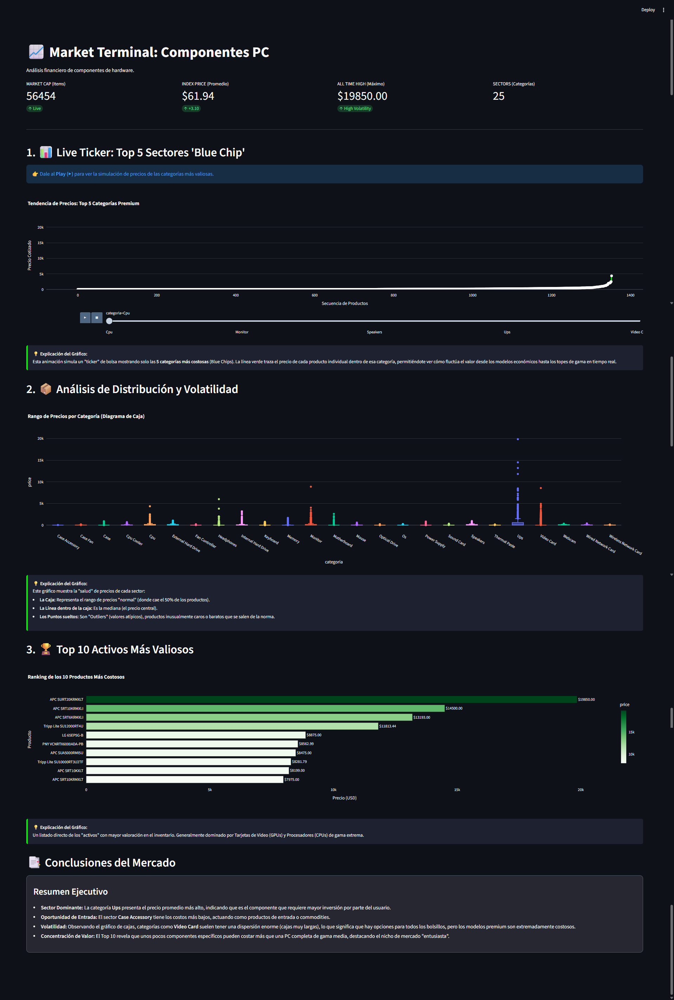
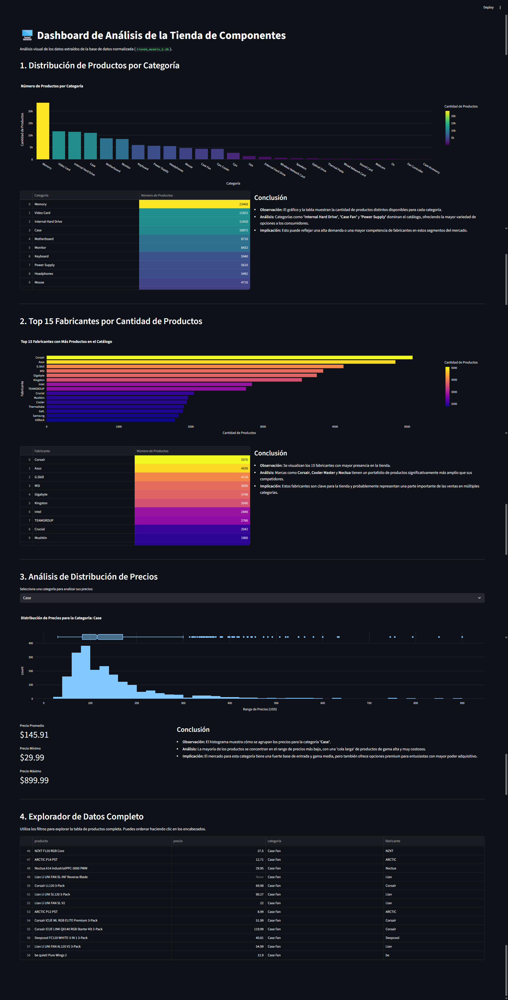

# 🚀 Portafolio de Big Data: Análisis de Bases de Datos con Python y SQLite

**Alumno:** Alexis Mendoza Corne  
**Curso:** Especialista en Big Data

---

## 👋 Presentación

¡Hola! Bienvenido a mi repositorio de prácticas. Este proyecto forma parte de mi formación como **Especialista en Big Data**. 

El objetivo principal de este módulo ha sido comprender y aplicar conceptos fundamentales de ingeniería de datos, específicamente:
1.  **Modelado de Datos:** Diferencias prácticas entre modelos desnormalizados (Estrella/Sábana) y normalizados (3NF).
2.  **ETL con Python:** Extracción de datos desde CSVs, transformación con Pandas y carga en SQLite.
3.  **Visualización de Datos:** Creación de dashboards interactivos utilizando Streamlit y Plotly.

---

## 🛠️ Pre-requisitos e Instalación

Para ejecutar los scripts y dashboards de este proyecto, se requiere tener instalado **Python** y las siguientes librerías.

Puedes instalarlas ejecutando el siguiente comando en tu terminal:

```bash
pip install pandas streamlit plotly faker
```

---

## 📂 Proyectos Realizados

### Proyecto 1: Tienda de Informática

Este proyecto se enfoca en el análisis de un catálogo de componentes de PC. Se crearon dos modelos de bases de datos (desnormalizado y normalizado) para comparar su rendimiento y estructura.

#### 📊 Visualización y Dashboards (Tienda Informática)

*   **Dashboard "Market Terminal" (Modelo A):** Adopta un estilo financiero para analizar los componentes como si fueran activos en bolsa.
    *   
*   **Dashboard Analítico (Modelo B):** Se enfoca en un análisis descriptivo clásico.
    *   

#### 🚀 Cómo Ejecutar (Tienda Informática)
```bash
# Dashboard Modelo A (Trading)
streamlit run ejercicios/01_bases_de_datos/1.1_introduccion_sqlite/dashboard_modelo_a.py

# Dashboard Modelo B (Analítico)
streamlit run ejercicios/01_bases_de_datos/1.1_introduccion_sqlite/dashboard.py
```

---

### Proyecto 2: Jardinería

Este proyecto simula la gestión de una empresa de jardinería. El flujo de trabajo completo incluye la creación de una base de datos relacional desde cero, la generación de datos sintéticos, un análisis exploratorio (EDA) y la creación de un dashboard de gestión.

#### 📂 Estructura del Proyecto (Jardinería)
```text
Ejercicio_bd/
├── ejercicio_jardineria/
│   ├── crear_bd_jardineria.py       # Script para generar la BD y los datos
│   ├── consultas_jardineria.py      # Ejemplos de consultas SQL
│   ├── eda_exploratorio_jardineria.py # Script de Análisis Exploratorio
│   ├── Analisis_datos_jardineria.md # Documento de hallazgos y diagramas ER
│   ├── dashboard_jardineria.py      # Dashboard de gestión
│   └── jardineria.db                # Base de datos generada
└── ...
```

#### 📊 Dashboard de Gestión (Jardinería)
Un dashboard multi-página que permite visualizar KPIs, un mapa de clientes, rendimiento de ventas y un organigrama de la empresa.

> **[INSERTA AQUÍ TU CAPTURA DE PANTALLA DEL DASHBOARD DE JARDINERÍA]**

#### 🚀 Cómo Ejecutar (Jardinería)
```bash
# Primero, crear la base de datos (solo una vez)
python ejercicio_jardineria/crear_bd_jardineria.py

# Luego, lanzar el dashboard
streamlit run ejercicio_jardineria/dashboard_jardineria.py
```

---

## 📚 Recursos de Apoyo

*   **Python & Pandas:** Para la manipulación y limpieza de datos.
*   **SQLite:** Motor de base de datos ligero y eficiente.
*   **Streamlit:** Framework para la creación rápida de Web Apps de Data Science.
*   **Plotly:** Librería para gráficos interactivos y animados.
*   **Faker:** Para la generación de datos de prueba realistas.

---
*Proyecto desarrollado por Alexis Mendoza Corne - 2025*
