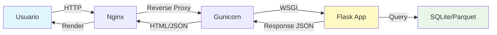

<<<<<<< HEAD
# Dashboards

Guia para crear y desplegar dashboards interactivos con Flask y Chart.js.

---

## Vision General

En este curso aprenderas a crear dashboards profesionales que:

- :bar_chart: Visualizan millones de registros de forma eficiente
- :arrows_counterclockwise: Son interactivos y responsivos
- :rocket: Pueden desplegarse en produccion
- :art: Tienen diseno profesional

---

## Dashboard NYC Taxi EDA

### Descripcion

Dashboard interactivo de Analisis Exploratorio de Datos (EDA) del dataset de NYC Taxi.

**Caracteristicas principales:**

- Visualizacion de 10M+ registros
- Filtros dinamicos por fecha, hora, zona
- Mapas de calor de rutas rentables
- Graficos interactivos con Chart.js
- API REST para consultas de datos
- Deploy con Docker

### Tech Stack

```
Frontend:
├── HTML5 + Bootstrap 5
├── Chart.js (graficos)
├── Leaflet.js (mapas)
└── JavaScript vanilla

Backend:
├── Flask (web framework)
├── Pandas/Dask (procesamiento)
└── SQLite/Parquet (datos)

Deploy:
├── Docker
├── Nginx (opcional)
└── Gunicorn (WSGI server)
```

### Arquitectura



---

## Estructura del Proyecto

```
dashboards/nyc_taxi_eda/
├── app.py                  # Flask application
├── requirements.txt        # Dependencias
├── Dockerfile             # Container config
├── docker-compose.yml     # Orchestration
│
├── static/
│   ├── css/
│   │   └── style.css
│   ├── js/
│   │   ├── charts.js      # Logica de graficos
│   │   └── maps.js        # Logica de mapas
│   └── images/
│
├── templates/
│   ├── base.html          # Template base
│   ├── index.html         # Dashboard principal
│   └── about.html         # Acerca de
│
├── data/
│   └── taxi.db            # Base de datos
│
└── utils/
    ├── data_loader.py     # Carga de datos
    ├── analytics.py       # Logica de analisis
    └── cache.py           # Sistema de cache
```

---

## Funcionalidades del Dashboard

### 1. Pagina Principal

!!! example "Vista General"

    **Metricas clave:**

    - Total de viajes
    - Ingreso total
    - Distancia promedio
    - Duracion promedio

    **Graficos:**

    - Viajes por hora del dia (linea)
    - Distribucion de metodos de pago (pie)
    - Top 10 rutas (bar)
    - Tendencia temporal (area)

### 2. Filtros Interactivos

```javascript
Filtros disponibles:
- Rango de fechas (date picker)
- Hora del dia (slider)
- Zona de pickup (dropdown)
- Metodo de pago (checkboxes)
- Rango de tarifas (range slider)
```

### 3. Mapa de Calor

Visualizacion geografica de:

- Densidad de pickups
- Zonas mas rentables
- Rutas populares
- Puntos de interes

### 4. API REST

Endpoints disponibles:

```python
GET /api/trips              # Lista de viajes
GET /api/stats              # Estadisticas generales
GET /api/hourly             # Datos por hora
GET /api/routes             # Rutas populares
GET /api/heatmap            # Datos para mapa de calor

# Con filtros
GET /api/stats?date_from=2021-01-01&date_to=2021-01-31
```

---

## Guia de Desarrollo

### Paso 1: Setup del Entorno

```bash
# Clonar repositorio
cd dashboards/nyc_taxi_eda

# Crear entorno virtual
python -m venv venv
source venv/bin/activate  # Windows: venv\Scripts\activate

# Instalar dependencias
pip install -r requirements.txt
```

### Paso 2: Cargar Datos

```python
# utils/data_loader.py
import pandas as pd
import sqlite3

def load_data():
    """Carga datos desde SQLite"""
    conn = sqlite3.connect('data/taxi.db')
    df = pd.read_sql_query("SELECT * FROM trips", conn)
    conn.close()
    return df

def get_stats():
    """Calcula estadisticas generales"""
    conn = sqlite3.connect('data/taxi.db')
    query = """
        SELECT
            COUNT(*) as total_trips,
            SUM(total_amount) as total_revenue,
            AVG(trip_distance) as avg_distance,
            AVG(trip_duration) as avg_duration
        FROM trips
    """
    stats = pd.read_sql_query(query, conn)
    conn.close()
    return stats.to_dict('records')[0]
```

### Paso 3: Crear Rutas Flask

```python
# app.py
from flask import Flask, render_template, jsonify
from utils.data_loader import load_data, get_stats

app = Flask(__name__)

@app.route('/')
def index():
    """Pagina principal del dashboard"""
    stats = get_stats()
    return render_template('index.html', stats=stats)

@app.route('/api/stats')
def api_stats():
    """API: Estadisticas generales"""
    stats = get_stats()
    return jsonify(stats)

@app.route('/api/hourly')
def api_hourly():
    """API: Datos por hora"""
    # TODO: Implementar query
    return jsonify(data)

if __name__ == '__main__':
    app.run(debug=True)
```

### Paso 4: Frontend con Chart.js

```javascript
// static/js/charts.js

// Grafico de viajes por hora
async function loadHourlyChart() {
    const response = await fetch('/api/hourly');
    const data = await response.json();

    const ctx = document.getElementById('hourlyChart').getContext('2d');
    new Chart(ctx, {
        type: 'line',
        data: {
            labels: data.map(d => d.hora),
            datasets: [{
                label: 'Viajes por Hora',
                data: data.map(d => d.total),
                borderColor: 'rgb(75, 192, 192)',
                tension: 0.1
            }]
        },
        options: {
            responsive: true,
            plugins: {
                title: {
                    display: true,
                    text: 'Distribucion de Viajes por Hora del Dia'
                }
            }
        }
    });
}

// Cargar al iniciar
document.addEventListener('DOMContentLoaded', loadHourlyChart);
```

---

## Optimizacion de Rendimiento

### Caching

```python
from flask_caching import Cache

cache = Cache(app, config={'CACHE_TYPE': 'simple'})

@app.route('/api/stats')
@cache.cached(timeout=300)  # Cache por 5 minutos
def api_stats():
    return jsonify(get_stats())
```

### Paginacion

```python
@app.route('/api/trips')
def api_trips():
    page = request.args.get('page', 1, type=int)
    per_page = request.args.get('per_page', 100, type=int)

    offset = (page - 1) * per_page
    query = f"""
        SELECT * FROM trips
        LIMIT {per_page} OFFSET {offset}
    """
    # ...
```

### Agregacion Previa

En lugar de calcular en tiempo real, pre-agrega datos:

```sql
-- Crear tabla de agregacion
CREATE TABLE hourly_stats AS
SELECT
    strftime('%Y-%m-%d %H:00:00', tpep_pickup_datetime) as hour,
    COUNT(*) as trip_count,
    AVG(total_amount) as avg_fare,
    SUM(total_amount) as total_revenue
FROM trips
GROUP BY hour;

-- Crear indice
CREATE INDEX idx_hour ON hourly_stats(hour);
```

---

## Deploy con Docker

### Dockerfile

```dockerfile
FROM python:3.11-slim

WORKDIR /app

COPY requirements.txt .
RUN pip install --no-cache-dir -r requirements.txt

COPY . .

EXPOSE 5000

CMD ["gunicorn", "--bind", "0.0.0.0:5000", "app:app"]
```

### docker-compose.yml

```yaml
version: '3.8'

services:
  web:
    build: .
    ports:
      - "5000:5000"
    volumes:
      - ./data:/app/data
    environment:
      - FLASK_ENV=production
    restart: always

  nginx:
    image: nginx:alpine
    ports:
      - "80:80"
    volumes:
      - ./nginx.conf:/etc/nginx/nginx.conf
    depends_on:
      - web
```

### Ejecutar

```bash
# Build y start
docker-compose up -d

# Ver logs
docker-compose logs -f

# Stop
docker-compose down
```

---

## Mejores Practicas

### 1. Seguridad

```python
# CORS
from flask_cors import CORS
CORS(app)

# Rate limiting
from flask_limiter import Limiter
limiter = Limiter(app, default_limits=["200 per day", "50 per hour"])

# Input validation
from werkzeug.exceptions import BadRequest

@app.route('/api/trips')
def api_trips():
    page = request.args.get('page', 1, type=int)
    if page < 1 or page > 1000:
        raise BadRequest("Invalid page number")
```

### 2. Logging

```python
import logging

logging.basicConfig(level=logging.INFO)
logger = logging.getLogger(__name__)

@app.route('/api/stats')
def api_stats():
    logger.info("Stats endpoint called")
    try:
        stats = get_stats()
        return jsonify(stats)
    except Exception as e:
        logger.error(f"Error in stats: {e}")
        return jsonify({"error": "Internal server error"}), 500
```

### 3. Testing

```python
# tests/test_app.py
import pytest
from app import app

@pytest.fixture
def client():
    app.config['TESTING'] = True
    with app.test_client() as client:
        yield client

def test_index(client):
    rv = client.get('/')
    assert rv.status_code == 200

def test_api_stats(client):
    rv = client.get('/api/stats')
    assert rv.status_code == 200
    data = rv.get_json()
    assert 'total_trips' in data
```

---

## Recursos

### Librerias Recomendadas

- [Flask](https://flask.palletsprojects.com/)
- [Chart.js](https://www.chartjs.org/)
- [Leaflet.js](https://leafletjs.com/)
- [Bootstrap](https://getbootstrap.com/)
- [Pandas](https://pandas.pydata.org/)

### Tutoriales

- [Flask Mega-Tutorial](https://blog.miguelgrinberg.com/post/the-flask-mega-tutorial-part-i-hello-world)
- [Chart.js Documentation](https://www.chartjs.org/docs/latest/)
- [Docker for Python](https://docs.docker.com/language/python/)

---

## Ejemplos de Dashboards

!!! example "Galeria de Proyectos"

    **Proximamente:** Galeria de dashboards destacados de alumnos.

    Si completaste el Ejercicio 05 y quieres que tu dashboard aparezca aqui, crea un PR!

---

## Proximos Pasos

- [Ejercicio 05: Dashboard Interactivo](../ejercicios/index.md) - Crear tu propio dashboard
- [Roadmap](../guia-inicio/roadmap.md) - Ver todos los ejercicios
- [FAQ](../faq.md) - Preguntas frecuentes
=======
# Galeria de Visualizaciones y Dashboards

Resultados de los algoritmos de Machine Learning y NLP del curso.
Cada pagina incluye analisis, graficos y codigo fuente.

---

## Machine Learning

### Analisis completos

- [PCA + Clustering K-Means: Dataset Iris](02_pca_iris_clustering.md) -- Reduccion dimensional y agrupamiento sobre el dataset clasico de Fisher
- [Manual PCA estilo FactoMineR](02_PCA_FactoMineR_style.md) -- Replicando el estandar de oro del analisis multivariante en Python

### Series Temporales

- [ARIMA/SARIMA - Metodologia Box-Jenkins](04_series_temporales_arima.md) -- Identificacion, estimacion, diagnostico y pronostico
- [Dashboard ARIMA (interactivo)](04_series_temporales_arima.html){target="_blank"} -- 6 pestanas: serie, descomposicion, ACF/PACF, diagnostico, forecast, radar
- [Dashboard ARIMA PRO](arima-sarima-pro.md) -- Tema financiero tipo Bloomberg, KPIs, 7 pestanas, comparativa de modelos
- [Dashboard ARIMA PRO (interactivo)](dashboard_arima_pro.html){target="_blank"} -- Diseno inspirado en OECD Explorer y Portfolio Optimizer

### Computer Vision (Transfer Learning)

- [Clasificacion de Flores con Transfer Learning](flores-transfer-learning.md) -- MobileNetV2 + ML tradicional sobre embeddings
- [Dashboard Flores (interactivo)](dashboard_flores.html){target="_blank"} -- t-SNE, comparativa modelos, confusion matrix, radar

### Dashboards interactivos (HTML)

- [Dashboard PCA Iris (interactivo)](02_pca_iris_dashboard.html){target="_blank"} -- Visualizacion completa en pantalla
- [Dashboard FactoMineR (interactivo)](02_PCA_FactoMineR_style.html){target="_blank"} -- Circulos de correlacion y biplots

---

## NLP y Text Mining

### Ejercicios guiados

- [Ejercicio 01: Anatomia del Texto y Conteo de Palabras](EJERCICIO_01_CONTEO.md) -- Frecuencia, tokenizacion y visualizacion
- [Ejercicio 02: Filtro de Stopwords](EJERCICIO_02_LIMPIEZA.md) -- Limpieza de ruido semantico

### Analisis completos

- [Similitud de Jaccard](04_similitud_jaccard.md) -- Comparacion de documentos y sistema de recomendacion
- [Vectorizacion y Clustering de Documentos](05_vectorizacion_y_clustering.md) -- TF-IDF, K-Means y analisis de topicos

---

## Analisis de Datos de Panel (Big Data)

### Pipeline completo: Spark + PostgreSQL + ML

- [Modulo 06: QoG - 4 Lineas de Investigacion + ML](06_analisis_panel_qog.md) -- Asia Central, Seguridad Hidrica, Terrorismo, Maghreb, PCA + K-Means
- [Dashboard QoG (interactivo)](06_analisis_panel_qog.html){target="_blank"} -- 5 pestanas con graficos Plotly interactivos

---

## Streaming y Cloud (Tiempo Real)

### Dashboards en vivo

- [Observatorio Sismico Global](dashboard_sismos_global.md) -- Sismos en tiempo real desde USGS API
- [Dashboard Sismos (interactivo)](dashboard_sismos_global.html){target="_blank"} -- Mapa Leaflet con datos en vivo, filtros por categoria
- [ISS Tracker](dashboard_iss_tracker.md) -- Seguimiento de la Estacion Espacial Internacional
- [Dashboard ISS (interactivo)](dashboard_iss_tracker.html){target="_blank"} -- Posicion en tiempo real, predictor de pases, trayectoria orbital

### Tecnologias

- **APIs en vivo:** USGS Earthquakes, Where The ISS At, Open Notify
- **Visualizacion:** Leaflet.js, CARTO dark tiles, Lucide icons
- **Actualizacion:** Auto-refresh cada 5-30 segundos

---

## Codigo fuente

Los scripts que generan estas visualizaciones estan en:

- `ejercicios/04_machine_learning/` -- PCA, K-Means, Silhouette
- `ejercicios/05_nlp_text_mining/` -- Conteo, limpieza, sentimiento, Jaccard
- `ejercicios/06_análisis_datos_de_panel/` -- Pipeline QoG con Apache Spark
- `ejercicios/07_infraestructura_bigdata/` -- Docker Compose, Cluster Spark
- `ejercicios/08_streaming_kafka/` -- Kafka, Spark Structured Streaming
- `ejercicios/09_cloud_localstack/` -- LocalStack, Terraform, AWS
>>>>>>> upstream/main
