# Como Crear un PR Limpio

!!! danger "PROBLEMA COMUN"
    Si tu PR tiene 30, 50 o 100+ commits cuando tu solo hiciste 5, esta guia es para ti.

---

## Por Que Pasa Esto?

Cuando sincronizas tu fork con `git merge`, Git copia **todos** los commits del profesor a tu historial.

```
Tu trabajo: 5 commits
+ Commits del profesor: 60 commits
= Tu PR: 65 commits 😱
```

**Resultado:** El profesor ve 65 commits y no puede identificar cual es tu trabajo.

---

## Solucion: Crear Rama Nueva

La forma mas simple de tener un PR limpio:

### Paso 1: Sincroniza tu fork desde GitHub

1. Ve a tu fork en GitHub
2. Click en **"Sync fork"** → **"Update branch"**

### Paso 2: Actualiza tu main local

```bash
git checkout main
git pull origin main
```

### Paso 3: Crea una rama NUEVA desde main actualizado

```bash
git checkout -b apellido-ejercicio-LIMPIO
```

**Importante:** Esta rama nueva ya tiene todos los ejercicios del profesor.

### Paso 4: Copia SOLO tus archivos

```bash
# Si ya tenias trabajo en otra rama
git checkout rama-vieja -- entregas/tu_carpeta/

# O simplemente crea tus archivos de nuevo
```

### Paso 5: Commit y push

```bash
git add entregas/tu_carpeta/
git commit -m "Entrega X.X - Tu Nombre"
git push origin apellido-ejercicio-LIMPIO
```

### Paso 6: Crea PR desde la rama nueva

Tu PR ahora tendra **solo tus commits**.

---

## Metodo Alternativo: Squash Local

Si ya tienes muchos commits y quieres limpiarlos:

```bash
# En tu rama de trabajo
git checkout tu-rama

# Combinar todos tus commits en 1
git rebase -i main

# En el editor: cambia "pick" por "squash" en todos menos el primero
# Guarda y cierra

# Force push (sobrescribe tu rama)
git push origin tu-rama --force
```

!!! warning "Cuidado con --force"
    Solo usa `--force` en TU rama personal, nunca en main.

---

## Que Hacer Si Ya Tienes un PR con Muchos Commits

**No te preocupes.** El profesor puede usar **"Squash and merge"** para limpiar el historial al aprobar tu PR.

Pero si quieres arreglarlo tu mismo:

1. Cierra tu PR actual (sin merge)
2. Sigue los pasos de "Crear Rama Nueva"
3. Crea un nuevo PR

---

## Resumen Visual

```mermaid
flowchart TD
    A[Tu fork desactualizado] --> B[Sync fork en GitHub]
    B --> C[git pull origin main]
    C --> D[git checkout -b rama-LIMPIA]
    D --> E[Crea/copia tus archivos]
    E --> F[git add + commit + push]
    F --> G[Crear PR]
    G --> H[PR con SOLO tus commits ✅]
```



---

## Prevencion: Flujo Ideal

Para evitar este problema desde el inicio:

```bash
# 1. SIEMPRE sincroniza ANTES de crear tu rama
git checkout main
git pull origin main  # (despues de Sync fork en GitHub)

# 2. Crea rama desde main actualizado
git checkout -b apellido-ejercicio-X.X

# 3. Trabaja SOLO en tu carpeta
# entregas/X.X/apellido_nombre/

# 4. Commits frecuentes y descriptivos
git add entregas/X.X/apellido_nombre/
git commit -m "Agregar solucion modelo A"

# 5. Push y PR
git push origin apellido-ejercicio-X.X
```

**Regla de oro:** Nunca hagas `git merge main` en tu rama de trabajo si ya creaste el PR.

---

## Enlaces Relacionados

- [Sincronizar Fork](sincronizar-fork.md) - Guia basica de sincronizacion
- [Guia de Entregas](../entregas/guia-entregas.md) - Workflow completo
- [Fork y Clone](fork-clone.md) - Primeros pasos
