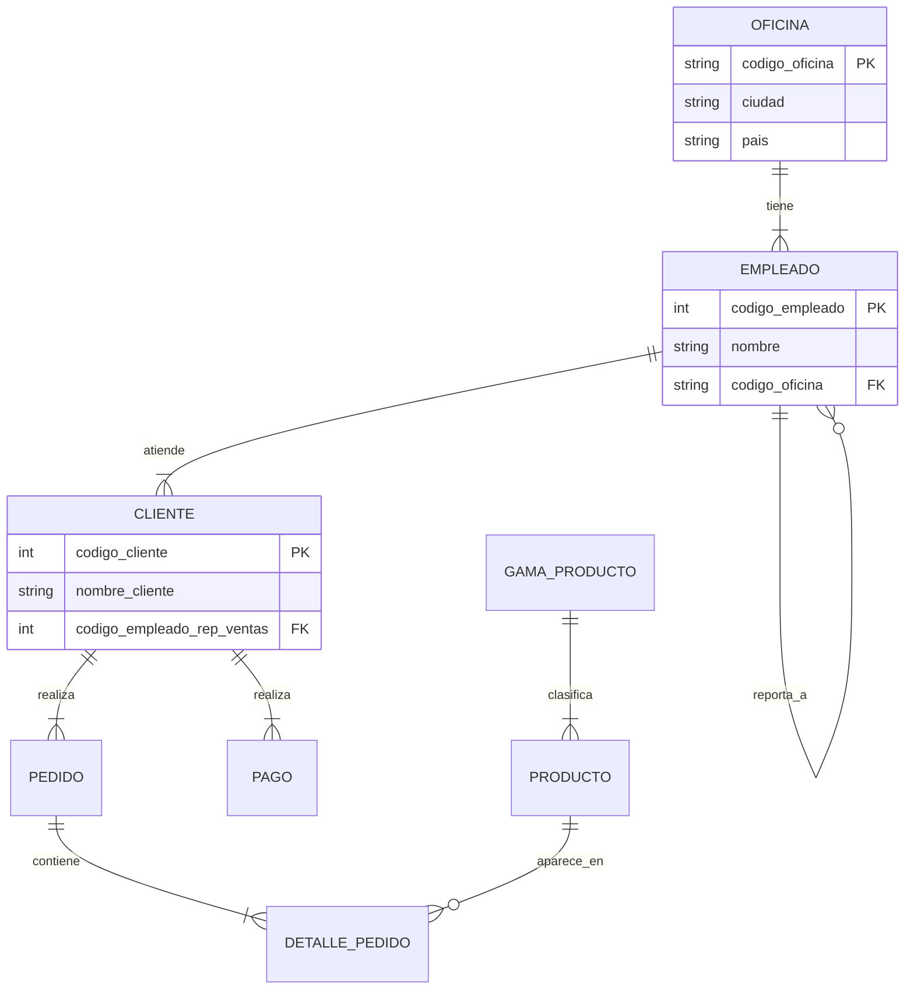
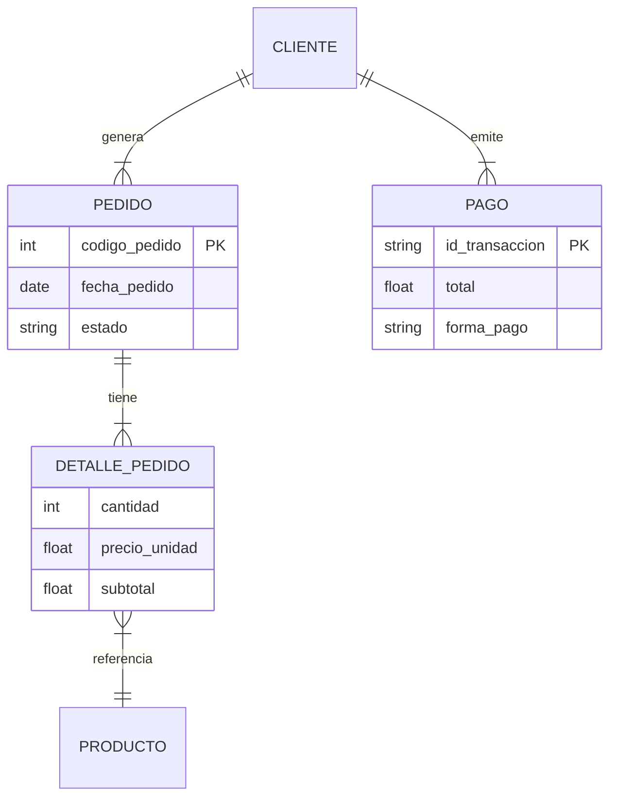
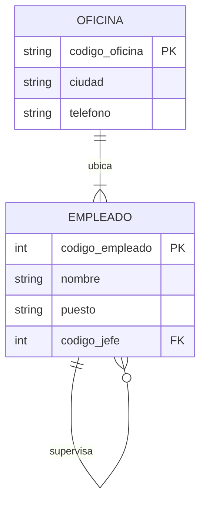
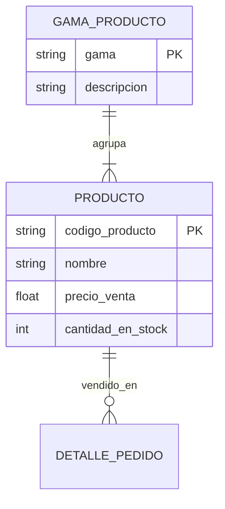

# 📊 Análisis de Datos: Base de Datos Jardinería

**Fecha:** 2025
**Base de Datos:** `jardineria.db`
**Herramienta de Análisis:** Python (Pandas + SQLite)

---

## 1. Resumen Ejecutivo

Tras ejecutar el análisis exploratorio de datos (EDA), se han identificado las siguientes métricas clave sobre la base de datos:

*   **Total de Tablas:** 8 tablas relacionales.
*   **Volumen de Datos:** Aproximadamente 20 registros por tabla (datos sintéticos generados para pruebas).
*   **Catálogo de Productos:** Se gestionan productos divididos en gamas (ej. Herramientas, Frutales, Ornamentales).
*   **Formas de Pago:** Se han identificado 4 métodos principales: PayPal, Transferencia, Cheque y Tarjeta.
*   **Total de Archivos/Entidades Cargadas:** 8 entidades principales (`oficina`, `empleado`, `gama_producto`, `cliente`, `pedido`, `producto`, `detalle_pedido`, `pago`).

---

## 2. Análisis de Estructura

La base de datos sigue un modelo relacional clásico. Se han identificado los siguientes patrones estructurales:

### Columnas Comunes (Claves de Relación)
Las tablas están fuertemente conectadas mediante claves primarias y foráneas. Las columnas más repetidas que actúan como nexo son:

*   `codigo_oficina`: Conecta la estructura física con el personal.
*   `codigo_empleado`: Conecta la jerarquía interna y la relación con clientes.
*   `codigo_cliente`: Eje central de las ventas y pagos.
*   `codigo_pedido`: Conecta la orden de compra con sus detalles.
*   `codigo_producto`: Identificador único del inventario.

### Tabla Resumen: Relación Oficina - Empleado
Esta relación define la estructura jerárquica y geográfica de la empresa.

| Tabla Origen | Tabla Destino | Cardinalidad | Descripción |
| :--- | :--- | :--- | :--- |
| **Oficina** | Empleado | 1:N | Una oficina física alberga a múltiples empleados. |
| **Empleado** | Empleado | 1:N | Relación recursiva: Un empleado (Jefe) tiene a su cargo otros empleados. |
| **Empleado** | Cliente | 1:N | Un representante de ventas gestiona una cartera de múltiples clientes. |

---

## 3. Análisis de Calidad de Datos

El análisis de calidad revela la integridad de la información generada:

*   **Valores Nulos:**
    *   Existen valores nulos esperados en campos opcionales como `linea_direccion2`, `region` o `comentarios` en pedidos.
    *   En la tabla `empleado`, el campo `codigo_jefe` tiene un nulo (el Director General), lo cual es correcto lógicamente.
*   **Duplicados:** No se han detectado filas completas duplicadas; las claves primarias garantizan la unicidad.
*   **Integridad de Precios:**
    *   Se validó la columna `precio_venta` en la tabla `producto`.
    *   **Resultado:** Todos los valores son positivos (`> 0`). No existen precios negativos ni gratuitos, lo que garantiza la coherencia financiera.
*   **Pagos:** Los montos en la tabla `pago` son consistentes con los rangos definidos (positivos y dentro de márgenes realistas).

---

## 4. Identificación de Entidades

A partir del muestreo de datos, se han extraído los siguientes valores categóricos clave:

### Proveedores (Muestra)
Los productos son suministrados por diversas empresas ficticias generadas, tales como:
*   *Empresas generadas aleatoriamente por Faker (ej. "Hermanos García", "Suministros del Sur", etc.)*

### Estados de Pedido
El ciclo de vida de un pedido pasa por los siguientes estados estandarizados:
1.  **Pendiente**
2.  **En tránsito**
3.  **Entregado**
4.  **Rechazado**

---

## 5. Conclusiones para el Diseño

### Relación 1:N (Oficina - Empleado) vs. Tabla Única (Flat File)

En este modelo, observamos una relación de **Uno a Muchos (1:N)** entre `oficina` y `empleado`.

> **¿Por qué es mejor este modelo relacional?**
>
> Si utilizáramos una tabla única (tipo Excel/CSV plano) donde cada fila fuera un empleado que incluyera toda la información de su oficina (Ciudad, Dirección, Teléfono, País), estaríamos cometiendo un error de **redundancia de datos**.
>
> *   **Redundancia:** Si hay 20 empleados en la oficina de "Madrid", repetiríamos la dirección de Madrid 20 veces.
> *   **Mantenimiento:** Si la oficina de Madrid cambia de teléfono, tendríamos que actualizar 20 registros. En el modelo relacional, solo actualizamos 1 registro en la tabla `oficina`.
> *   **Integridad:** Evita errores de escritura (ej. escribir "Madrdi" en un empleado y "Madrid" en otro).

---

## 6. Diagramas Entidad-Relación (Mermaid)

A continuación, se presentan 4 vistas del modelo de datos para facilitar su comprensión.

### Diagrama 1: Visión Global (Estructura Completa)
Muestra todas las tablas y sus conexiones principales.

### Diagrama 2: Flujo de Ventas (Core Business)
Se centra en cómo un cliente genera ingresos (Pedidos y Pagos).

### Diagrama 3: Estructura de Recursos Humanos
Muestra la jerarquía interna y la ubicación física del personal.

### Diagrama 4: Catálogo de Productos
Muestra cómo se organiza el inventario.

