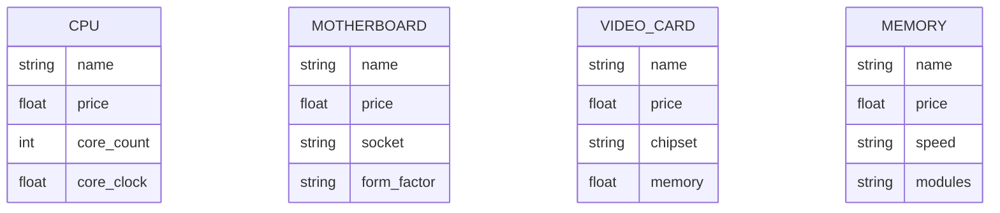
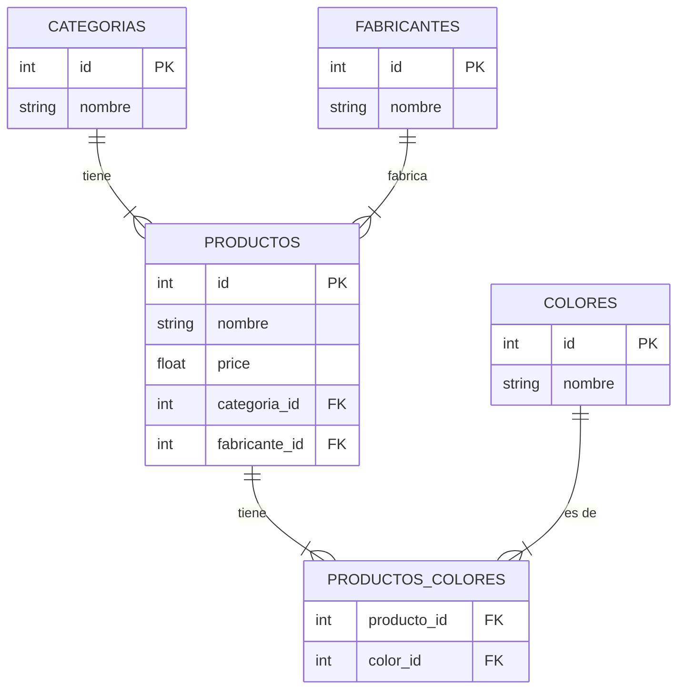
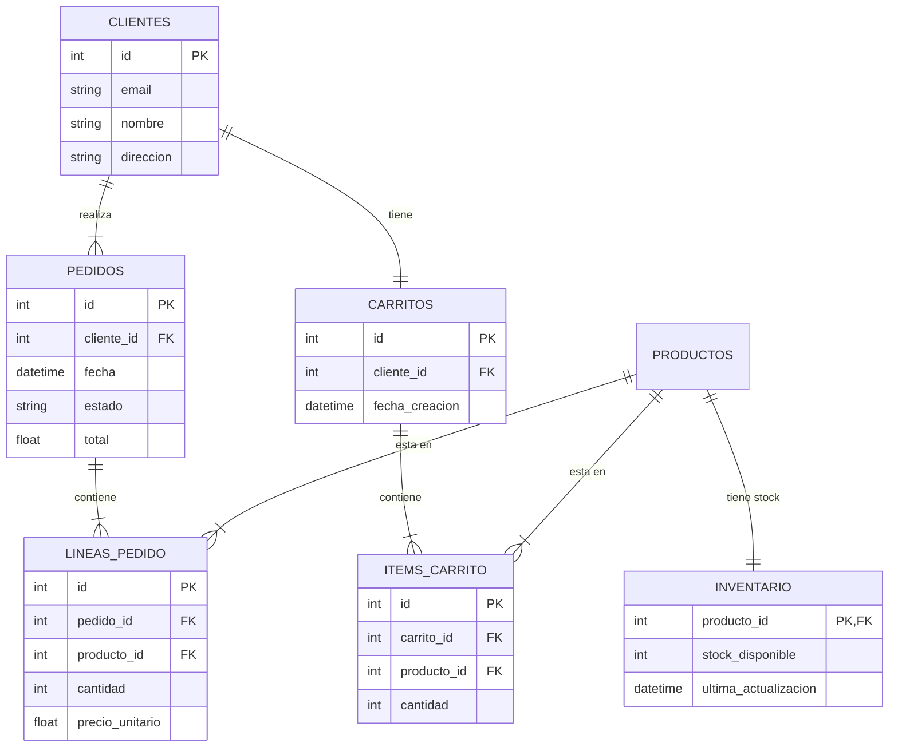

# Análisis de Datos - Tienda de Informática

## 1. Resumen Ejecutivo

Este documento presenta los hallazgos del Análisis Exploratorio de Datos (EDA) realizado sobre el conjunto de datos de componentes informáticos.

*   **Archivos CSV analizados:** 25 archivos.
*   **Total de productos:** Aproximadamente 41,000 registros (sumando las filas de todos los archivos, aunque hay duplicados).
*   **Categorías diferentes:** 25 categorías, correspondientes a cada archivo CSV (ej. `cpu`, `motherboard`, `monitor`, etc.).

## 2. Análisis de Estructura

### Columnas Comunes
Tras analizar todos los archivos, se identificaron las siguientes columnas presentes en **todos** los CSVs:
*   `name`: Nombre del producto.
*   `price`: Precio del producto.

### Columnas Específicas (Ejemplos)
Cada categoría tiene atributos únicos que definen sus características técnicas:
*   **CPU:** `core_count`, `core_clock`, `socket`.
*   **Motherboard:** `socket`, `form_factor`, `max_memory`, `memory_slots`.
*   **Memory:** `speed`, `modules`, `cas_latency`.
*   **Storage (HDD/SSD):** `capacity`, `type`, `cache`, `interface`.
*   **Video Card:** `chipset`, `memory`, `core_clock`.
*   **Monitor:** `screen_size`, `resolution`, `refresh_rate`, `panel_type`.

### Tabla Resumen (Top 10 Archivos por Volumen)

| Archivo (Categoría) | Filas (Aprox.) |
| :--- | :--- |
| `memory` | 11,734 |
| `video-card` | 5,811 |
| `internal-hard-drive` | 5,705 |
| `case` | 5,486 |
| `motherboard` | 4,358 |
| `monitor` | 4,216 |
| `keyboard` | 2,970 |
| `power-supply` | 2,805 |
| `headphones` | 2,746 |
| `mouse` | 2,355 |

## 3. Análisis de Calidad

### Valores Nulos
Se detectó una cantidad significativa de valores nulos, especialmente en la columna `price`.
*   **Precio (`price`):** Muchos archivos tienen más del 50% de nulos en esta columna (ej. `case` 81%, `video-card` 82%, `motherboard` 83%). Esto es crítico para un e-commerce.
*   **Atributos técnicos:** Algunas columnas específicas también presentan nulos (ej. `color` en varios archivos, `boost_clock` en CPUs).

### Duplicados
Se encontraron filas duplicadas en casi todos los archivos, aunque en proporciones bajas (generalmente menos del 5-10%).
*   Ejemplos: `memory` (794 duplicados), `internal-hard-drive` (458 duplicados).

### Consistencia de Precios
*   Los rangos de precios parecen razonables (no hay negativos).
*   Se observan productos de gama muy alta (ej. monitores de $8,000+, CPUs de $4,000+) y accesorios económicos.
*   El promedio de precios varía lógicamente según la categoría (ej. `mouse` ~$60 vs `video-card` ~$680).

## 4. Identificación de Entidades

### Fabricantes
Se extrajeron **639 fabricantes únicos** a partir de la primera palabra del nombre del producto.
*   Ejemplos destacados: Corsair, Logitech, Samsung, MSI, Gigabyte, Asus, Intel, AMD, Western Digital, etc.

### Colores
Se identificaron **171 colores únicos** (o combinaciones de colores).
*   La columna `color` no está presente en todos los archivos (ej. `cpu`, `os` no tienen color).
*   Los valores no están normalizados (ej. "Black", "Black/Red", "Matte Black").

### Categorías
Las 25 categorías corresponden directamente a los nombres de los archivos CSV:
`case-accessory`, `case-fan`, `case`, `cpu-cooler`, `cpu`, `external-hard-drive`, `fan-controller`, `headphones`, `internal-hard-drive`, `keyboard`, `memory`, `monitor`, `motherboard`, `mouse`, `optical-drive`, `os`, `power-supply`, `sound-card`, `speakers`, `thermal-paste`, `ups`, `video-card`, `webcam`, `wired-network-card`, `wireless-network-card`.

## 5. Conclusiones para el Diseño

### Entidades para el Modelo B (Normalizado)
Basado en el análisis, el esquema normalizado debe incluir:

1.  **Categorias:** Para almacenar los 25 tipos de productos.
2.  **Fabricantes:** Para normalizar los 639 fabricantes y evitar repetir cadenas de texto.
3.  **Productos:** Tabla central. Debe tener `nombre`, `precio` (manejando nulos), FK a `categoria` y FK a `fabricante`.
    *   *Nota:* Dado que cada categoría tiene atributos muy distintos (ej. `socket` vs `screen_size`), en un modelo relacional estricto se perderían estos detalles si solo usamos una tabla `Productos` genérica, a menos que usemos una estructura EAV (Entity-Attribute-Value) o herencia, pero para este ejercicio simplificado, nos centraremos en los campos comunes (`name`, `price`).
4.  **Colores:** Para normalizar la lista de colores.
5.  **Productos_Colores:** Tabla intermedia para la relación muchos a muchos (un producto puede venir en varios colores, o la columna `color` del CSV indica una variante específica).

### Relaciones
*   **Categoría - Producto:** 1:N (Una categoría tiene muchos productos).
*   **Fabricante - Producto:** 1:N (Un fabricante crea muchos productos).
*   **Producto - Color:** M:N (Un producto puede tener asociados colores, aunque en los CSVs actuales, cada fila suele representar una variante de color específica, lo que podría simplificarse a 1:N si consideramos cada fila como un SKU único).

### Crítica al Modelo A (Desnormalizado)
El Modelo A (una tabla por CSV) es ineficiente por:
1.  **Redundancia:** El nombre del fabricante se repite miles de veces (ej. "Corsair" escrito en cada fila de memoria RAM).
2.  **Dificultad de Mantenimiento:** Si un fabricante cambia de nombre, habría que actualizar millones de registros en 25 tablas diferentes.
3.  **Consultas Complejas:** Para buscar "todos los productos de Corsair", habría que hacer 25 consultas SQL (una por tabla) y unir los resultados, lo cual es computacionalmente costoso y difícil de programar.
4.  **Integridad de Datos:** No hay restricciones que impidan escribir "Corsair" en una fila y "Corsair Inc." en otra, ensuciando los datos.

## 6. Diagramas Entidad-Relación

### Diagrama ER - Modelo A: Catálogo Simple (Desnormalizado)

El Modelo A consiste en 26 tablas independientes, una por cada archivo CSV. No existen relaciones entre ellas, lo que genera alta redundancia.

### Diagrama ER - Modelo B: Normalizado (3NF)

El Modelo B normaliza la información, centralizando fabricantes y categorías para evitar duplicidad.

### Diagrama ER - Modelo C: E-Commerce Completo

El Modelo C extiende el Modelo B añadiendo entidades transaccionales para gestionar un sistema de ventas completo.

