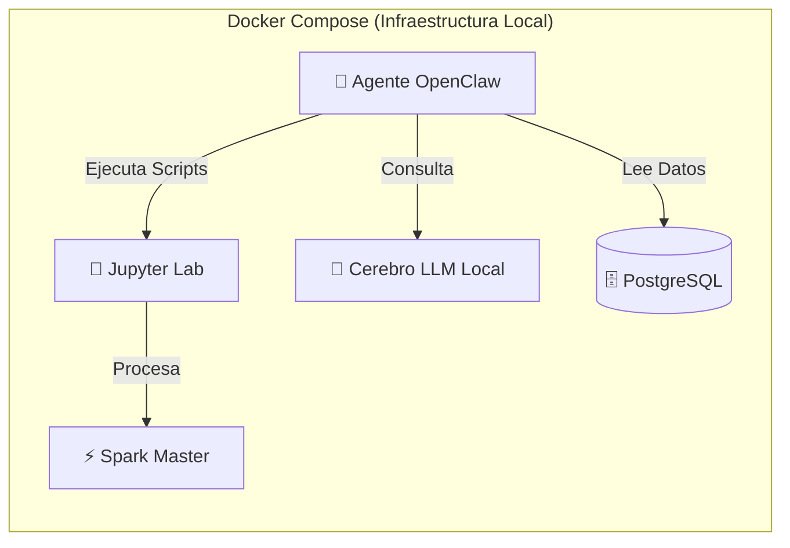

# 🚀 Retos a Implementar: Integración de Agente IA Autónomo (OpenClaw)

Esta guía detalla la hoja de ruta para llevar el proyecto al siguiente nivel ("Nivel Dios") mediante la incorporación de un **Analista de IA Autónomo** que trabaja 24/7 sobre tus datos de Big Data.

---

## 1. El Concepto: "El Analista Fantasma" 👻

El objetivo es integrar **OpenClaw**, un agente de IA open-source, para que actúe como un miembro más del equipo.
*   **Rol:** Analista de Inteligencia Jr.
*   **Capacidades:**
    *   Leer noticias sobre "Gasto Militar" cada mañana.
    *   Ejecutar pipelines de Spark automáticamente cuando llegan nuevos datos.
    *   Responder preguntas en lenguaje natural sobre tu base de datos (Chat with Data).
*   **Costo:** **$0 (Gratis)** usando modelos locales vía **Ollama**.

---

## 2. Requisitos del Sistema (PC) 💻

Para correr esto localmente sin pagar API de OpenAI, tu PC se convierte en el servidor de IA.

| Componente | Mínimo (Lento) | Recomendado (Fluido) | ¿Por qué? |
| :--- | :--- | :--- | :--- |
| **RAM** | 16 GB | **32 GB** | Docker + Spark consume ~8GB. El modelo de IA (7B parámetros) necesita ~6-8GB más. |
| **Procesador** | Intel i5 / Ryzen 5 | **Intel i7 / Ryzen 7** | Si no tienes tarjeta gráfica, el procesador hará todo el cálculo (lento). |
| **Tarjeta Gráfica (GPU)** | Integrada | **NVIDIA RTX 3060+ (8GB VRAM)** | Vital para que la IA responda en segundos y no en minutos. |
| **Disco** | 20 GB Libres | **50 GB Libres** | Los modelos de IA (LLMs) pesan entre 4GB y 20GB. |

---

## 3. Nueva Arquitectura Propuesta 🏗️

Así quedaría tu ecosistema de contenedores al añadir los servicios de IA:



---

## 4. ¿Cómo se verá? (Wireframe Conceptual) 🖼️

Imagina una nueva pestaña en tu Dashboard con este diseño:

```text
+-----------------------------------------------------------------------+
|  🛡️ GEOPOLITICS COMMAND CENTER - OPENCLAW INTEGRATION      [🟢 ONLINE] |
+--------------------------+--------------------------------------------+
|  🤖 AGENTE "CLAW"        |  🌍 MAPA DE CONFLICTOS (LIVE)              |
|                          |                                            |
| [CLAW]: He detectado     |      [.....Afghanistan.....]               |
| un aumento del 15% en    |            / | \                           |
| el presupuesto militar   |           /  |  \   <-- Alerta Roja    |
| de Uzbekistán.           |          /   |   \                         |
|                          |                                            |
| [TÚ]: ¿A qué se debe?    +--------------------------------------------+
|                          |  📊 ESTADÍSTICAS DEL SISTEMA               |
| [CLAW]: Noticias locales |                                            |
| indican tensiones en la  |  RAM: [||||||....] 64%                     |
| frontera sur.            |  GPU: [||||||||..] 82% (Ollama Running)    |
| ¿Ejecuto una simulación? |                                            |
|                          |  > Spark Job #9921: COMPLETED (4.2s)       |
| [TÚ]: Sí, adelante.      |  > Data Ingestion:  PENDING                |
+--------------------------+--------------------------------------------+
```

---

## 5. Ejemplo de Uso: "Chat con tus Datos" 💬

Ya no tendrás que escribir consultas SQL o código Python para preguntas rápidas.

**Escenario Actual:**
> *Tengo que abrir Jupyter, cargar pandas, filtrar el DataFrame y hacer un plot.*

**Escenario Futuro (Nivel Dios):**
> **Tú:** "@OpenClaw, compárame el cambio de régimen político en Kirguistán vs Turkmenistán en los últimos 5 años."
>
> **OpenClaw:** *Consultando base de datos Spark...*
> "Aquí tienes el gráfico. Kirguistán muestra alta volatilidad (3 cambios de régimen), mientras que Turkmenistán permanece estático en Autocracia. He generado el reporte en PDF."

---

## 6. Estructura de Archivos Futura 📂

Añadiremos una carpeta `ia_agents` para configurar la personalidad y herramientas de OpenClaw.

```text
Alexis_Mendoza/
├── docker-compose.yml         # (Modificado para incluir OpenClaw + Ollama)
├── RETOS_A_IMPLEMENTAR.md     # (Este archivo)
├── ia_agents/                 # [NUEVA] Configuración del Agente
│   ├── config.yaml            # Personalidad: "Eres un experto en geopolítica..."
│   └── tools/                 # Scripts que el agente puede usar
│       └── run_pipeline.sh    # Script para re-entrenar el modelo
├── src/                       # Tu código actual
└── ... (resto de archivos)
```

---

## 5. Software Necesario 🛠️

Solo necesitas instalar/configurar 3 cosas:

1.  **Docker Desktop:** Ya lo tienes instalado. ✅
2.  **Ollama (Servidor de Modelos):**
    *   Es el software que permite descargar modelos como "Llama 3" o "Mistral" y usarlos offline.
    *   Se instala dentro de Docker (fácil) o en Windows directamente (más rápido).
3.  **OpenClaw (El Agente):**
    *   Es una imagen de Docker que descargaremos.

---

## 6. ¿Cómo lo implementaremos? (Hoja de Ruta)

Cuando decidas ejecutarlo, estos serán los pasos técnicos:

### Paso 1: Modificar `docker-compose.yml`
Añadiremos los servicios para que se levanten junto con tu proyecto.

```yaml
# BLOQUE FUTURO PARA AGENTE IA
  ollama:
    image: ollama/ollama:latest
    ports:
      - "11434:11434"
    volumes:
      - ollama_data:/root/.ollama
    deploy:
      resources:
        reservations:
          devices:
            - driver: nvidia
              count: 1
              capabilities: [gpu]

  openclaw:
    image: openclaw/core:latest
    environment:
      - LLM_PROVIDER=ollama
      - OLLAMA_BASE_URL=http://ollama:11434
    volumes:
      - ./ia_agents:/app/config
      - ./data:/app/data
    depends_on:
      - ollama
```

### Paso 2: Descargar el Cerebro
Ejecutaremos un comando para bajar el modelo de inteligencia (aprox 4GB):
`docker exec ollama ollama run llama3`

### Paso 3: ¡A Jugar! 🎮
Podrás entrar a una interfaz web (tipo ChatGPT) pero controlada por tu propio OpenClaw, conectado directamente a tus datos de Big Data y capaz de lanzar tus procesos de Spark.
