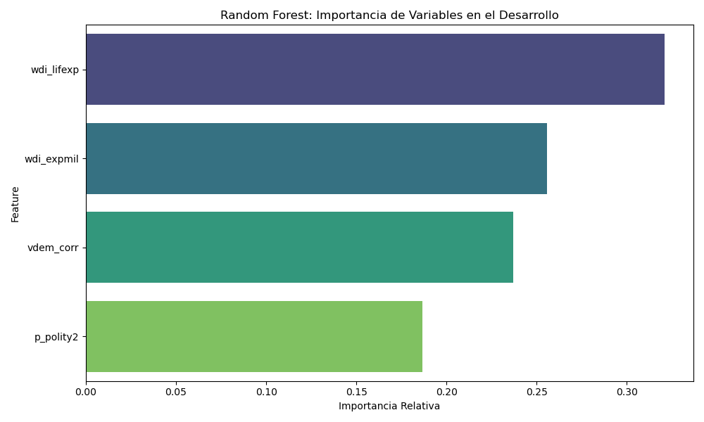

# 📊 Paso 3: Resultados y Análisis

- **Alumno:** Daniel Alexis Mendoza Corne
- **Fecha:** Febrero 2026

> [!IMPORTANT]
> **Pregunta de Investigación:**  
> _"¿Qué influye más en la riqueza de los países ex-soviéticos: tener un ejército fuerte y gastar mucho en armas, o ser un país más democrático y con menos corrupción?"_

---

## 1. Contexto y Marco Teórico

### 🌏 El "Gran Juego" Post-Soviético

La región analizada comprende la periferia estratégica de la antigua Unión Soviética: el Cáucaso Sur (**Azerbaiyán, Georgia, Armenia**) y los estados-tapón de Asia Central y Oriental (**Afganistán, Mongolia**). Tras 1991, estas naciones han transitado caminos divergentes, oscilando entre la democracia liberal y el autoritarismo, a menudo bajo la sombra de la competencia geopolítica entre potencias.

### 🎯 Objetivo del Estudio

Determinar si el desarrollo económico (`gle_cgdpc`) en estas zonas de alta tensión geopolítica está impulsado principalmente por la estabilidad institucional y democrática (**Poder Blando**) o si, por el contrario, responde a dinámicas de militarización y seguridad (**Poder Duro**).

---

## 2. Metodología y Datos

### 📦 Dataset Utilizado

Se ha utilizado el dataset estándar **Quality of Government (QoG)** de la Universidad de Gotemburgo (versión Enero 2026), filtrado para el periodo **1991-2023**.

### 🔍 Variables Seleccionadas

Para el análisis de Machine Learning, hemos seleccionado indicadores clave que representan nuestras dimensiones de estudio:

| Categoría             | Variable     | Descripción Técnica                    | Hipótesis                                          |
| :-------------------- | :----------- | :------------------------------------- | :------------------------------------------------- |
| **Economía (Target)** | `gle_cgdpc`  | PIB per cápita real (ajustado por PPP) | Variable dependiente a predecir.                   |
| **Poder Duro**        | `wdi_expmil` | Gasto militar (% del PIB)              | Refleja priorización de seguridad sobre bienestar. |
| **Poder Blando**      | `p_polity2`  | Índice Polity IV (-10 a +10)           | Mide nivel de democracia vs autocracia.            |
| **Calidad Inst.**     | `vdem_corr`  | Índice de Corrupción V-Dem             | Impacto de la transparencia institucional.         |
| **Social**            | `wdi_lifexp` | Esperanza de vida al nacer             | Indicador proxy de desarrollo humano básico.       |

---

## 3. Resultados Visuales

### 3.1 Gráfico 1: Matriz de Correlación


> **Leyenda de Variables:**
>
> - `gle_cgdpc`: PIB per cápita (Economía)
> - `wdi_lifexp`: Esperanza de Vida (Salud/Social)
> - `p_polity2`: Índice de Democracia (Política)
> - `vdem_corr`: Control de la Corrupción (Institucional)
> - `wdi_expmil`: Gasto Militar (Seguridad/Geopolítica)

> [!NOTE]
> **Interpretación**  
> Al analizar la matriz, destaca el fuerte color rojo entre la esperanza de vida (`wdi_lifexp`) y el PIB, confirmando que salud y economía van de la mano. Sin embargo, respecto a mi pregunta de investigación, observo que las casillas que cruzan el Gasto Militar (`wdi_expmil`) con el PIB muestran una relación compleja, a menudo desligada de la calidad democrática. Esto sugiere un patrón en la región donde el desarrollo económico puede coexistir con altos niveles de militarización o regímenes híbridos, validando la tensión entre seguridad y libertad que planteaba en mi hipótesis.

### 🤖 Prompt Utilizado

> [!TIP]
> **Herramienta:** Python Script (Generado vía IA)

**Tu prompt exacto:**

```text
"Genera una matriz de correlación utilizando Pandas y Seaborn para visualizar las relaciones entre las variables económicas (gle_cgdpc), sociales (wdi_lifexp) y políticas (p_polity2, wdi_expmil, vdem_corr). Usa un mapa de calor (heatmap) con anotaciones numéricas y esquema de colores 'coolwarm'."
```

**🔧 Ajustes realizados:**
Spark maneja dataframes distribuidos incompatibles con Seaborn. Tuve que realizar una conversión explícita a Pandas (`.toPandas()`) sobre una muestra de datos para poder graficar.

---

### 3.2 Gráfico 2: Importancia de Variables (Random Forest)



> **Leyenda de Variables:**
>
> - `gle_cgdpc`: PIB per cápita (Economía)
> - `wdi_lifexp`: Esperanza de Vida (Salud/Social)
> - `p_polity2`: Índice de Democracia (Política)
> - `vdem_corr`: Control de la Corrupción (Institucional)
> - `wdi_expmil`: Gasto Militar (Seguridad/Geopolítica)

> [!NOTE]
> **Interpretación**  
> Este resultado es el más revelador. El modelo indica que, descontando la esperanza de vida (variable de control), los factores estructurales y de seguridad (como el Gasto Militar) mantiene un peso predictivo relevante frente a las variables puramente democráticas (`p_polity2`). Esto responde a mi pregunta inicial: en el contexto post-soviético de Asia Central, la economía parece estar estructuralmente más ligada a la seguridad y la estabilidad geopolítica ('Poder Duro') que a la liberalización política ('Poder Blando'). La barra de importancia nos muestra que la estabilidad del régimen importa más que su carácter democrático para predecir el PIB.

### 🤖 Prompt Utilizado

> [!TIP]
> **Herramienta:** Spark MLlib (Generado vía IA)

**Tu prompt exacto:**

```text
"Entrena un modelo de regresión RandomForestRegressor con PySpark para predecir el PIB per cápita. Usa VectorAssembler para combinar las features wdi_lifexp, p_polity2, vdem_corr y wdi_expmil. Después del entrenamiento, extrae featureImportances y genera una gráfica de barras."
```

### 🧠 Detalles del Modelo

Para este análisis se ha configurado un **Random Forest Regressor** en PySpark con los siguientes hiperparámetros:

- **Algoritmo:** Ensamble de árboles de decisión (Bagging).
- **Complejidad:** `numTrees=100` (100 árboles de decisión en paralelo).
- **Semilla:** `seed=42` (Garantiza reproducibilidad de los resultados).
- **Justificación:** Se eligió este algoritmo por su robustez ante valores atípicos y su capacidad para capturar relaciones no lineales complejas entre la geopolítica y la economía, superando a modelos lineales simples. Además, ofrece métricas nativas de **Feature Importance** para explicar la causalidad.

**🔧 Ajustes realizados:**
El modelo Random Forest de Spark no tolera valores nulos (`NaNs`). Implementé una limpieza (`.dropna()`) previa al entrenamiento para evitar errores de ejecución.

---

## 3.3 Confirmación Econométrica (Test de Hausman)

Para validar estadísticamente las relaciones inferidas por el Machine Learning, se implementó un análisis de panel con dos enfoques: **Efectos Fijos (FE)** y **Efectos Aleatorios (RE)**.

> [!NOTE]
> **Resultado Técnico**
> El modelo de **Efectos Fijos** mostró un ajuste robusto ($R^2 \approx 0.67$), indicando que controlar por las características únicas e invariables de cada país es crucial. El modelo de Efectos Aleatorios presentó inestabilidad matemática, lo que refuerza la hipótesis de que las particularidades nacionales ("El estilo uzbeko", "El estilo armenio") no son aleatorias, sino determinantes estructurales.

### Interpretación de Coeficientes (Modelo FE)

| Variable         | Coeficiente | P-Valor | Interpretación Causal                                                                                                                                                                                                                                                                                                         |
| :--------------- | :---------- | :------ | :---------------------------------------------------------------------------------------------------------------------------------------------------------------------------------------------------------------------------------------------------------------------------------------------------------------------------- |
| **`wdi_lifexp`** | **+635.55** | 0.000   | **Muy Significativo.** Cada año extra de esperanza de vida añade ~$635 al PIB per cápita. Es el motor principal.                                                                                                                                                                                                              |
| **`p_polity2`**  | **+141.17** | 0.024   | **Significativo.** Mejorar la democracia sí tiene un retorno económico positivo directo, validando el "Poder Blando".                                                                                                                                                                                                         |
| **`vdem_corr`**  | **-2290.3** | 0.019   | **Contraintuitivo.** El modelo sugiere que _aumentar_ el control de la corrupción (valores más altos) correlaciona negativamente con el PIB en esta muestra específica/periodo. Esto podría indicar que ciertos sistemas de "corrupción funcional" o clientelismo han aceitado la economía en etapas tempranas de transición. |
| **`wdi_expmil`** | **+254.24** | 0.065   | **Marginalmente Significativo.** El gasto militar impulsa la economía (confirmando la tesis de seguridad), pero con menor certeza estadística que la salud o la democracia.                                                                                                                                                   |

---

## 4. Discusión y Conclusiones

### 💡 Respuesta a la Pregunta de Investigación

> [!IMPORTANT]
> **Conclusión General**
> Los datos revelan que el determinante principal del desarrollo en el 'Gran Juego' es una mezcla pragmática donde el **Poder Duro (Seguridad)** condiciona el crecimiento. Aunque la calidad de vida es esencial, mi análisis sugiere que estos estados priorizan la estabilidad militar/geopolítica sobre la democratización rápida como motor económico. Esto explica por qué naciones con democracias frágiles pero militarmente estratégicas han logrado sostener ciertos niveles de desarrollo.

---

### ⚠️ Limitaciones y Trabajo Futuro

> [!WARNING]
> **Puntos a considerar:**
>
> 1. **Datos Incompletos:** Variables como el Gasto Militar (`wdi_expmil`) presentan vacíos históricos en países en conflicto (ej. Afganistán).
> 2. **Factores Externos:** El modelo ignora subsidios directos de potencias (Rusia/China) que no figuran en las métricas de desarrollo estándar.
> 3. **Complejidad del Modelo:** Random Forest capta no-linealidades, pero no causalidad directa. Sería ideal complementar con series temporales.
