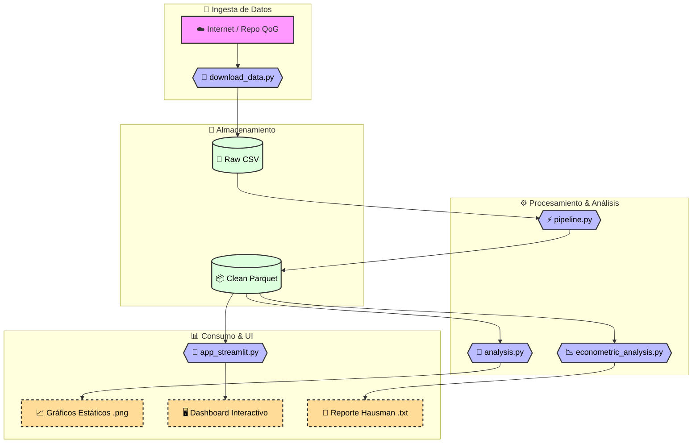

# 📡 Análisis Computacional de Geopolítica: El "Gran Juego" Post-Soviético

> **Un enfoque de Big Data para entender la economía y seguridad en Asia Central.**

<div align="center">
    
    <h3>👤 Daniel Alexis Mendoza Corne</h3>
    <p>
         <b>Ingeniería Informática y de Sistemas</b> |
        <a href="https://www.linkedin.com/in/alexismendoza12/">
            
        </a>
    </p>
    <p>
        <a href="https://alxz0212.github.io/TF_BigData_CDM/">
            
        </a>
    </p>
</div>

---

## 📌 Resumen Ejecutivo

Este proyecto aplica técnicas de **Big Data** e **Ingeniería de Software** para resolver una pregunta fundamental de las Ciencias Políticas:

> _"¿Son los factores de 'Poder Duro' (Gasto Militar) o de 'Poder Blando' (Democracia, Control de Corrupción) los que determinan el desarrollo económico en la periferia post-soviética?"_

A través de un pipeline automatizado, se procesaron décadas de datos históricos de países clave del **"Gran Juego"** (Afganistán, Mongolia, Cáucaso) para modelar matemáticamente sus trayectorias de desarrollo.

### 🛠️ Tech Stack


---

<div align="center">
  <h3>🎥 Demo: El Gran Juego en Acción</h3>
  
  <p><i>Tablero interactivo con Globo 3D, Análisis Comparativo y Simulador de IA.</i></p>
</div>

---

## 🗺️ Estructura de Navegación

| 🧭 Sección | 📝 Descripción |
| :--- | :--- |
| **[🚀 Guía de Trabajo](01_README.md)** | Paso a paso para completar el proyecto. Instrucciones detalladas. |
| **[🐳 Infraestructura](02_INFRAESTRUCTURA.md)** | Explicación técnica de Docker, servicios y redes. |
| **[💻 Catálogo de Código](05_EXPLICACION_CODIGO.md)** | Documentación técnica de scripts Python (`src/`) y Pipeline ETL. |
| **[📊 Resultados](03_RESULTADOS.md)** | Informe final con gráficos, modelos y hallazgos del "Gran Juego". |

---

## 🏗️ Arquitectura del Sistema

El proyecto implementa un flujo de datos moderno y contenerizado:



- **Infraestructura:** Docker Compose orquestando JupyterLab, Spark Master/Worker.
- **ETL:** PySpark para limpieza y transformación (`.parquet`).
- **Analítica:**
    - **Machine Learning:** Random Forest (Spark MLlib) para Feature Importance.
    - **Econometría:** Modelos de Datos de Panel (Fixed Effects vs Random Effects) y Test de Hausman.
- **Frontend:** Dashboard interactivo en Streamlit para exploración de datos.

---

## 🔍 Hallazgos Principales

### 1. Inteligencia Artificial (Random Forest)
El modelo identificó que, descontando la salud básica (`Esperanza de Vida`), los factores de **Seguridad y Estabilidad del Régimen** tienen un peso predictivo superior a la mera democratización.

### 2. Validación Econométrica (Test de Hausman)
Se aplicó un **Test de Hausman** comparando modelos de Efectos Fijos vs Aleatorios.
- **Resultado:** Se prefirió el modelo de **Efectos Fijos** ($P < 0.05$).
- **Interpretación:** Las características únicas e invariables de cada país ("El estilo uzbeko", "La geografía afgana") son determinantes estructurales del éxito o fracaso económico, confirmando la hipótesis de heterogeneidad regional.

---

## 🚀 Instrucciones de Despliegue

```bash
# 1. Levantar la infraestructura
docker compose up -d

# 2. Descargar e Ingestar Datos
docker exec jupyter_lab python /home/jovyan/work/src/download_data.py

# 3. Ejecutar Pipeline ETL (Raw -> Parquet)
docker exec jupyter_lab python /home/jovyan/work/src/pipeline.py

# 4. Entrenar Modelo de Machine Learning (Spark)
docker exec jupyter_lab spark-submit /home/jovyan/work/src/analysis.py

# 5. Ejecutar Análisis Econométrico (Hausman)
docker exec jupyter_lab python /home/jovyan/work/src/econometric_analysis.py

# 6. Lanzar Dashboard Web (http://localhost:8501)
# Opción A: Versión Clásica
docker exec -d jupyter_lab streamlit run /home/jovyan/work/src/app_streamlit.py

# Opción B: Versión PRO (3D Command Center) 🌟
docker exec -d jupyter_lab streamlit run /home/jovyan/work/src/app_streamlit_pro.py
```

---

## 📂 Estructura del Repositorio

```text
├── 01_README.md                # Portada del proyecto (Este archivo)
├── 02_INFRAESTRUCTURA.md       # Documentación técnica de Docker
├── 03_RESULTADOS.md            # Informe detallado de hallazgos
├── 04_REFLEXION_IA.md          # Bitácora de co-creación con IA
├── 05_EXPLICACION_CODIGO.md    # Catálogo de scripts
├── 06_RESPUESTAS.md            # Preguntas de defensa
├── docker-compose.yml          # Orquestación
├── src/                        # Código Fuente Python
│   ├── pipeline.py             # Lógica ETL Big Data
│   ├── analysis.py             # ML Engine
│   ├── econometric_analysis.py # Stats Engine
│   └── app_streamlit.py        # Web App
└── data/                       # Lakehouse (Raw + Processed)
```

<small><i>Última actualización corrección visual: v3.0 (Markdown Table)</i></small>
